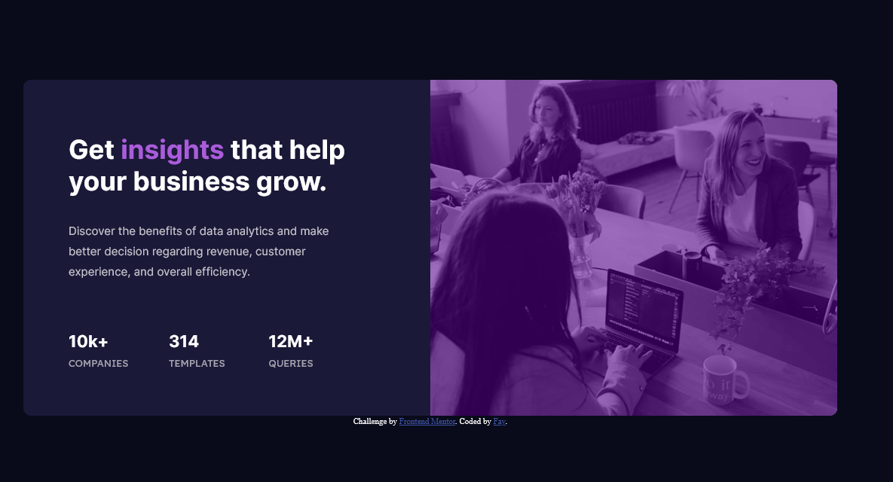

# Frontend Mentor - Stats preview card component [solution](#links)

## Table of contents

- [Overview](#overview)
  - [The challenge](#the-challenge)
  - [Screenshot](#screenshot)
  - [Links](#links)
- [My process](#my-process)
  - [Built with](#built-with)
  - [What I learned](#what-i-learned)
  - [Continued development](#continued-development)
  - [Useful resources](#useful-resources)
- [Author](#author)
- [Acknowledgments](#acknowledgments)

## Overview

### The challenge

Users should be able to:

- View the optimal layout depending on their device's screen size

### Screenshot



### Links

This is a solution to the [Stats preview card component challenge on Frontend Mentor](https://www.frontendmentor.io/challenges/stats-preview-card-component-8JqbgoU62).

- Live Site URL: [Stats Preivew Component](https://nottohave.github.io/Stats_preview/)

## My process

### Built with

- Semantic HTML5 markup
- CSS custom properties
- Flexbox
- Mobile-first workflow

### What I learned

I learned to scape out the design pattern on pen and paper. Then use Figma to figure out the size of certain components and arrange them to look like the given design.
I also learned how to apply color to the image. I tried to change the saturation of the img to match with the design but this is what I came close to. I would love to receive more feedbacks on my solutions.

```css
.right {
  width: 540px;
  height: 446px;
  background: url(./images/image-header-desktop.jpg);
  background-size: cover;
  position: relative;
  filter: contrast(150%);
  border-radius: 0px 10px 10px 0px;
}

.overlay {
  top: 0;
  left: 0;
  width: 100%;
  height: 100%;
  background: rgb(106, 59, 136);
  opacity: 0.7;
  border-radius: 0px 10px 10px 0px;
}
```

### Continued development

I will continue learning the design pattern and learn to use grid when necessary. I could also use Javascript on certain area but this project seems to be simple enough using just HTML and focus on CSS flex box styling. One difficult thing for me is to figure out how to reuse some css components from desktop in responsive mobile to make it less repetitive. I would love to practice more about that in the future.

## Author

- Twitter - [@Ubering_Cacti](https://twitter.com/Ubering_Cacti)
